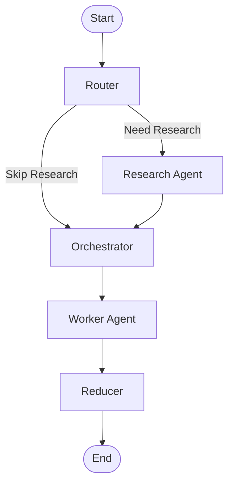

# ✍️ Agentic AI Blog Writer

> An intelligent multi-agent blog generation system powered by **LangGraph**, **LangChain**, **Google Gemini**, **FastAPI**, and **Streamlit**.

Automatically researches a topic, plans the article, generates high-quality content, reviews the output, and produces a polished blog post using an Agentic AI workflow.

---

## 🚀 Features

- 🤖 Multi-Agent Architecture using LangGraph
- 🧠 Google Gemini LLM Integration
- 🔀 Intelligent Router Node
- 🔍 Automated Topic Research
- 🎯 Orchestrator-Worker Pattern
- 📝 High-Quality Blog Generation
- ✅ AI-Based Review & Refinement
- ⚡ FastAPI Backend
- 🎨 Streamlit User Interface
- 💾 Persistent Workflow State
- 📄 Markdown Blog Output
- 🔄 Modular & Scalable Design

---

# 🏗️ Agent Workflow



---

# 📌 LangGraph Workflow

```text
assets/workflow.png
```

```markdown

```

---

# 🏛️ System Architecture

```
                User Topic
                     │
                     ▼
               FastAPI Backend
                     │
                     ▼
                LangGraph Graph
                     │
     ┌───────────────┼───────────────┐
     │               │               │
     ▼               ▼               ▼
  Router        Research       Orchestrator
                                      │
                                      ▼
                                 Worker Agent
                                      │
                                      ▼
                                   Reducer
                                      │
                                      ▼
                                Final Blog Post
                                      │
                                      ▼
                               Streamlit Frontend
```

---

# 🛠️ Tech Stack

## AI Framework

- LangGraph
- LangChain

## LLM

- Google Gemini

## Backend

- FastAPI
- Uvicorn

## Frontend

- Streamlit

## Language

- Python 3.11+

---

# 📂 Project Structure

```
Agentic-AI-Blog-Writer/
│
├── notebooks/
│   ├── 1_bwa_basic.ipynb
│   ├── 2_bwa_improved_prompting.ipynb
│   ├── 3_bwa_research.ipynb
│   ├── 4_bwa_research_fine_tuned.ipynb
│   └── 5_bwa_image.ipynb
│
├── assets/
│   └── workflow.png
│
├── app.py
├── bwa_backend.py
├── requirements.txt
├── README.md
├── LICENSE
└── .gitignore
```

---

# ⚙️ Installation

Clone the repository

```bash
git clone https://github.com/SajadaliAI/Agentic-AI-Blog-Writer.git
```

Move into the project

```bash
cd Agentic-AI-Blog-Writer
```

Create a virtual environment

### Conda

```bash
conda create -n blogwriter python=3.11
conda activate blogwriter
```

or

### venv

```bash
python -m venv venv
```

Windows

```bash
venv\Scripts\activate
```

Linux / macOS

```bash
source venv/bin/activate
```

Install dependencies

```bash
pip install -r requirements.txt
```

---

# 🔑 Environment Variables

Create a `.env` file.

```env
GOOGLE_API_KEY=YOUR_GOOGLE_API_KEY
```

---

# ▶️ Run the Backend

```bash
uvicorn bwa_backend:app --reload
```

Backend

```
http://127.0.0.1:8000
```

---

# ▶️ Run the Frontend

```bash
streamlit run app.py
```

---

# 🧠 Workflow Explanation

### 1️⃣ Router

Determines whether external research is required before blog generation.

### 2️⃣ Research Agent

Collects relevant information and context about the requested topic.

### 3️⃣ Orchestrator

Coordinates the workflow and distributes tasks to worker agents.

### 4️⃣ Worker Agent

Generates the blog content based on the research and instructions.

### 5️⃣ Reducer

Aggregates and refines the generated content into a coherent final article.

---

# 📸 Demo

Add screenshots or a GIF inside the `assets/` folder.

```text
assets/demo.png
```

Example:

```markdown

```

---

# 📋 Requirements

- Python 3.11+
- Google Gemini API Key
- LangGraph
- LangChain
- FastAPI
- Streamlit

---

# 🚀 Future Improvements

- Web Search Integration
- RAG Support
- PDF Export
- DOCX Export
- WordPress Publishing
- Multi-language Blog Generation
- Human Feedback Loop
- Memory Support
- Citation Generation
- Image Generation

---

# 🤝 Contributing

Contributions are welcome.

1. Fork the repository
2. Create a new branch
3. Commit your changes
4. Push the branch
5. Open a Pull Request

---

# 📄 License

This project is licensed under the MIT License.

---

# 👨‍💻 Author

**Sajad Ali**

AI Engineer | Generative AI Developer | Agentic AI Enthusiast

GitHub: https://github.com/SajadaliAI

---

## ⭐ Support

If you found this project useful, don't forget to **Star ⭐ the repository**.